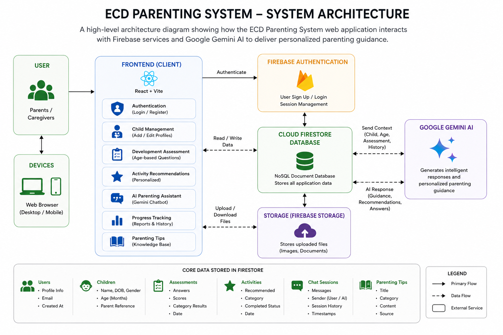
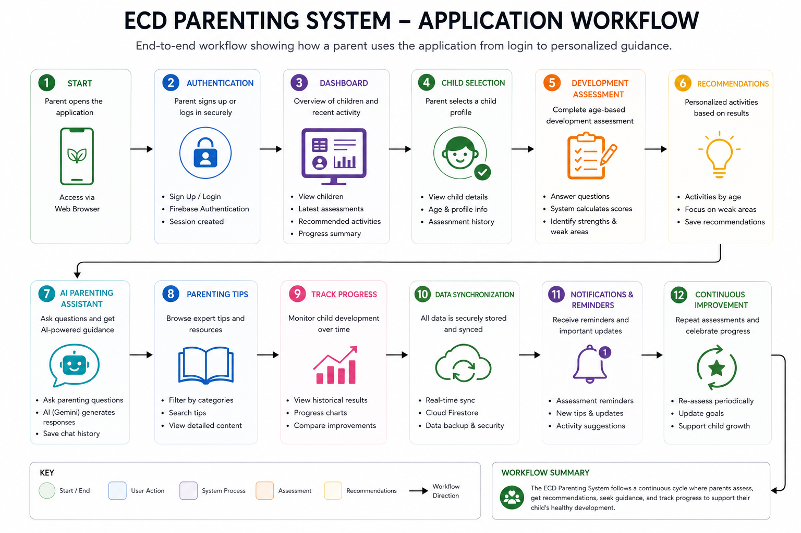
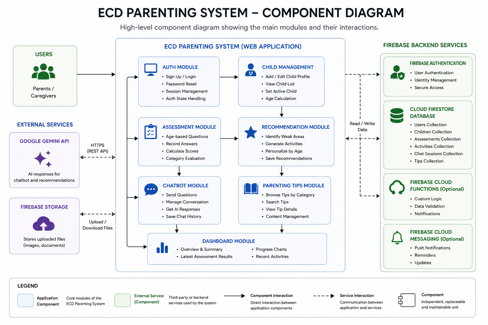
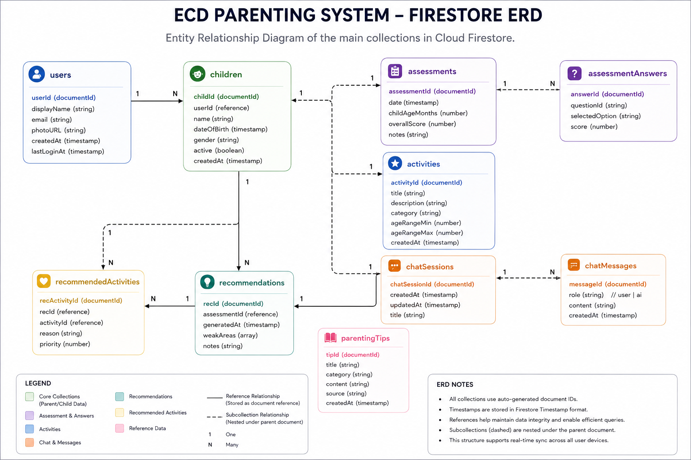
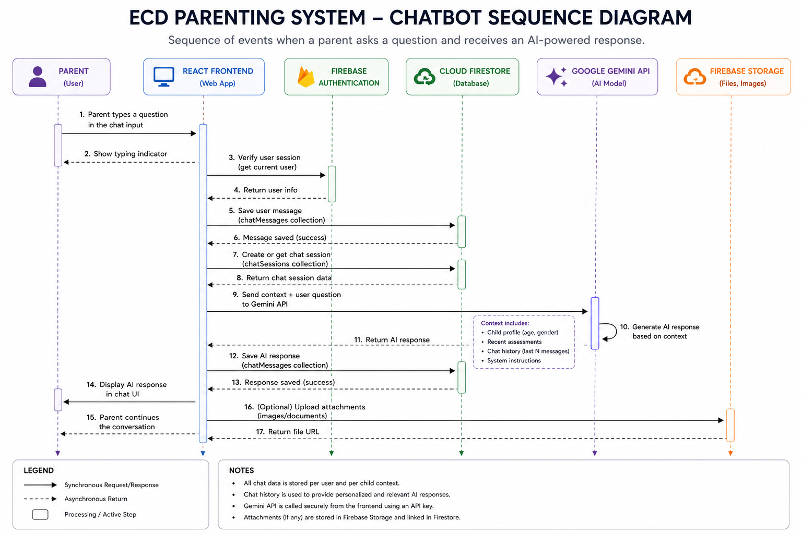
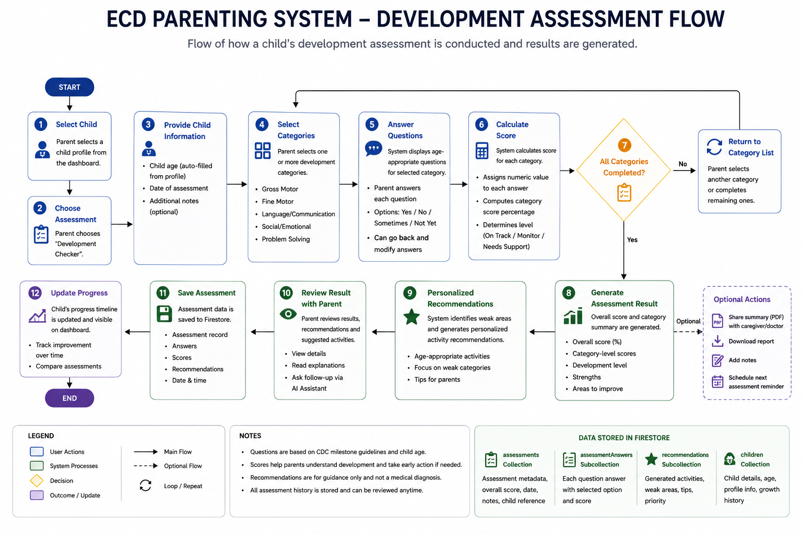

# 🌱 ECD Parenting System

An AI-powered web application that helps parents monitor early childhood development through age-based milestone assessments, personalized activity recommendations, and intelligent parenting guidance.

---

## 📖 Overview

The **ECD Parenting System** is designed to support parents and caregivers in monitoring the developmental progress of children from birth to 36 months.

The application combines evidence-based developmental assessments with cloud technology and artificial intelligence to provide personalized recommendations, progress tracking, and educational parenting guidance.

This system is intended as a **development support tool** and **does not replace professional medical advice or diagnosis**.

---

# ✨ Features

- 👶 Child Profile Management
- 📊 Age-Based Development Assessment
- 📈 Progress Tracking Dashboard
- 🎯 Personalized Activity Recommendations
- 🤖 AI Parenting Assistant (Google Gemini)
- 📚 Parenting Tips & Resources
- 🔐 Secure User Authentication
- ☁ Cloud Data Synchronization

---

# 🛠 Technologies

| Category | Technology |
|----------|------------|
| Frontend | React |
| Build Tool | Vite |
| Styling | CSS |
| Routing | React Router |
| Authentication | Firebase Authentication |
| Database | Cloud Firestore |
| Artificial Intelligence | Google Gemini API |
| Version Control | Git & GitHub |

---

# 📚 System Documentation

The following diagrams describe the design and implementation of the ECD Parenting System.

---

## 🏗 System Architecture

Illustrates the overall system architecture, including the React frontend, Firebase services, Cloud Firestore, and Google Gemini AI.



---

## 🔄 Application Workflow

Shows the complete application workflow from user authentication to AI-assisted parenting guidance.



---

## 🧩 Component Diagram

Describes the software components and interactions between application modules and backend services.



---

## 🗄 Firestore Entity Relationship Diagram (ERD)

Represents the Firestore collections, document relationships, and application data model.



---

## 🤖 AI Chatbot Sequence Diagram

Illustrates the interaction between the user, frontend, Firebase, Firestore, and Google Gemini AI during a chatbot conversation.



---

## 📋 Development Assessment Flow

Shows the workflow used to evaluate developmental milestones, calculate scores, and generate personalized recommendations.



---

# 📁 Project Structure

```text
ECD-Parenting-System
│
├── doc
│   └── diagrams
│       ├── application-workflow.png
│       ├── chatbot-sequence.png
│       ├── component-diagram.png
│       ├── development-assessment-flow.png
│       ├── firestore-erd.png
│       └── system-architecture.png
│
├── public
│
├── src
│   ├── assets
│   ├── components
│   ├── data
│   ├── firebase
│   ├── hooks
│   ├── pages
│   ├── services
│   ├── styles
│   ├── utils
│   ├── App.jsx
│   └── main.jsx
│
├── package.json
├── vite.config.js
├── .env
└── README.md
```

---

# 🚀 Installation

Clone the repository

```bash
git clone https://github.com/YOUR_USERNAME/ECD-Parenting-System.git
```

Navigate into the project

```bash
cd ECD-Parenting-System
```

Install dependencies

```bash
npm install
```

Create a `.env` file in the project root.

```env
VITE_FIREBASE_API_KEY=
VITE_FIREBASE_AUTH_DOMAIN=
VITE_FIREBASE_PROJECT_ID=
VITE_FIREBASE_STORAGE_BUCKET=
VITE_FIREBASE_MESSAGING_SENDER_ID=
VITE_FIREBASE_APP_ID=

VITE_GEMINI_API_KEY=
```

Run the application

```bash
npm run dev
```

---

# 🧠 AI Integration

The application integrates **Google Gemini AI** to provide personalized parenting guidance.

The chatbot generates responses using:

- Child profile information
- Child age
- Latest assessment results
- Development history
- Conversation context

All conversations are securely stored using Cloud Firestore.

---

# ☁ Firebase Services

The application uses Firebase for:

- User Authentication
- Cloud Firestore Database
- Secure Data Storage
- Real-Time Synchronization

---

# 📈 Future Enhancements

- Mobile application
- Pediatrician dashboard
- Growth chart visualization
- Vaccination tracker
- Offline mode
- Multi-language support
- AI model trained on child development literature

---

# 📄 License

This project is licensed under the MIT License.
